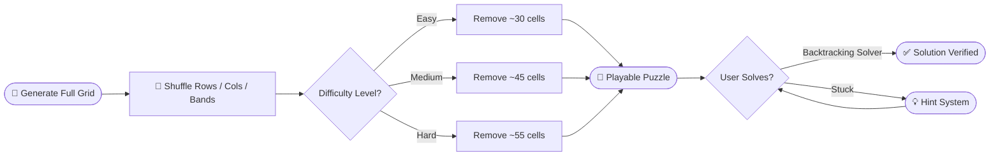
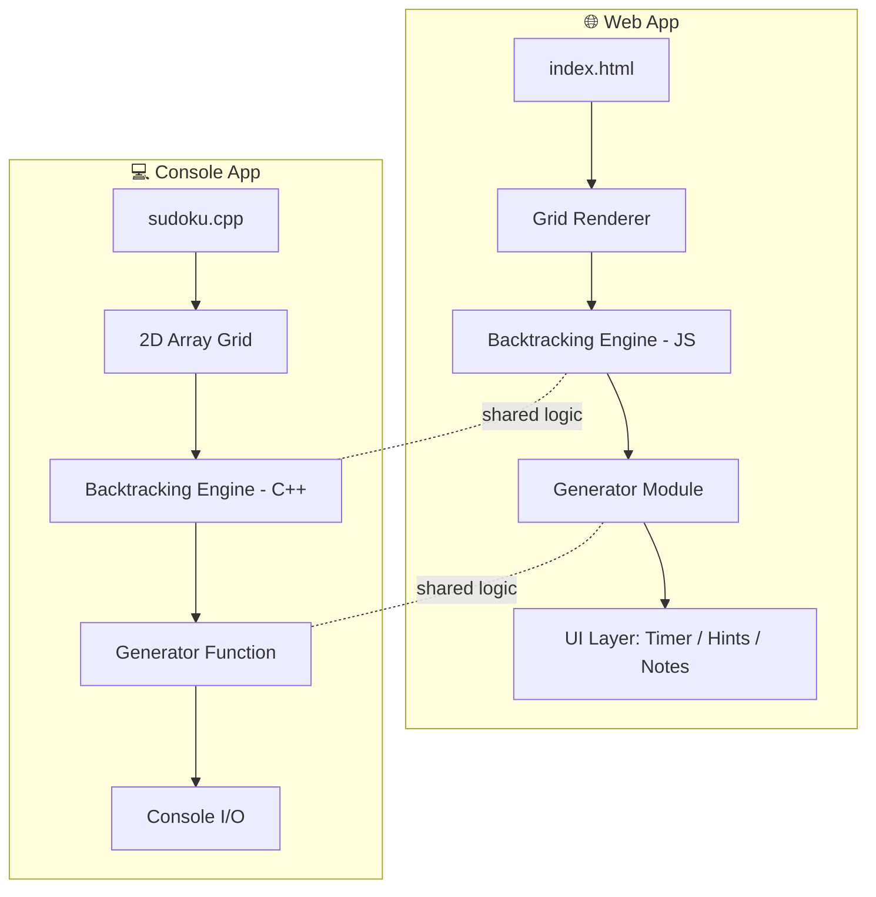

<div align="center">

<!-- Animated banner -->


<!-- Typing animation -->
<a href="https://ayeshajavid91-star.github.io/Sudoku-Web-App/">
  
</a>

<br/>

<!-- Badges -->
<p>
  
  
  
  
  
</p>

<p>
  
  
  
  
  
</p>

<h3>🧩 A recursive-backtracking Sudoku engine — playable in your browser, runnable in your terminal.</h3>

<a href="https://ayeshajavid91-star.github.io/Sudoku-Web-App/">
  
</a>

</div>

<br/>


---

## 📚 Table of Contents

| # | Section |
|---|---------|
| 1 | [✨ Overview](#-overview) |
| 2 | [🎬 Preview](#-preview) |
| 3 | [🚀 Features](#-features) |
| 4 | [🧠 How the Algorithm Works](#-how-the-algorithm-works) |
| 5 | [🏗️ Architecture](#️-architecture) |
| 6 | [🛠️ Tech Stack](#️-tech-stack) |
| 7 | [⚙️ Installation & Usage](#️-installation--usage) |
| 8 | [📂 Project Structure](#-project-structure) |
| 9 | [🗺️ Roadmap](#️-roadmap) |
| 10 | [🤝 Contributing](#-contributing) |
| 11 | [👩‍💻 Author](#-author) |
| 12 | [📄 License](#-license) |

---

## ✨ Overview

This project began as a **C++ console-based Sudoku solver and generator**, then evolved into a fully playable, interactive **web application** — no compiler, no setup, just open a browser.

Both versions share the exact same core logic:

> 🔁 **Recursive backtracking** to solve puzzles
> 🎲 **Constrained shuffling** to generate valid, uniquely-solvable puzzles at multiple difficulty levels

<div align="center">



</div>

---

## 🎬 Preview

<div align="center">

| 🖥️ Desktop View | 📱 Mobile View |
|:---:|:---:|
|  |  |

*(Replace these placeholder images with real screenshots or a screen-recorded GIF of your app in `/assets`)*

</div>

---

## 🚀 Features

<table>
<tr>
<td width="50%" valign="top">

### 🌐 Web Version — `JavaScript / HTML / CSS`

- 🧩 Interactive 9×9 Sudoku grid, manual input
- ⚡ **Instant Solve** via recursive backtracking
- 🎲 **Generate** puzzles — Easy / Medium / Hard
- 👁️ **Reveal Solution** & **Clear Grid**
- 🚨 Real-time invalid-move detection (red highlight)
- ⌨️ Keyboard arrow-key grid navigation
- 💡 **Hint system** for selected / next empty cell
- 🏆 **Win detection** with success banner
- ⏱️ Live **Timer** & **Move Counter**
- ↩️ **Undo** last move
- ✏️ **Notes / Pencil marks** per cell
- 📱 **Mobile-friendly** number pad
- 🔒 Locked given (clue) cells

</td>
<td width="50%" valign="top">

### 💻 C++ Console Version

- 🗂️ Sudoku grid as 2D array
- 🔁 Recursive backtracking solver
- 🎯 Adjustable-difficulty generator
- 🖤 Clean, structured console UI
- 🧮 Constraint validation (row / column / box)
- 📟 Lightweight — zero dependencies

</td>
</tr>
</table>

---

## 🧠 How the Algorithm Works

<details>
<summary><b>🔍 Click to expand — Backtracking Solver walkthrough</b></summary>

<br/>

1. Scan the grid for the next **empty cell**.
2. Try digits **1 → 9** in that cell.
3. For each digit, check row, column, and 3×3 box constraints.
4. If valid → place it and **recurse** into the next empty cell.
5. If no digit works → **backtrack**, clear the cell, and try the next candidate in the previous cell.
6. Repeat until the grid is full → ✅ solved.

```cpp
bool solve(int grid[9][9]) {
    int row, col;
    if (!findEmptyCell(grid, row, col))
        return true; // 🎉 solved

    for (int num = 1; num <= 9; num++) {
        if (isValid(grid, row, col, num)) {
            grid[row][col] = num;

            if (solve(grid))
                return true;

            grid[row][col] = 0; // 🔙 backtrack
        }
    }
    return false; // trigger backtracking
}
```

</details>

<details>
<summary><b>🎲 Click to expand — Puzzle Generator logic</b></summary>

<br/>

1. Generate a **fully solved**, randomly shuffled valid Sudoku grid.
2. Randomly remove numbers while checking the puzzle still has a **unique solution**.
3. Stop removing once the target **difficulty** cell-count is reached.

| Difficulty | Clues Remaining | Empty Cells |
|:---:|:---:|:---:|
| 🟢 Easy | ~45–50 | ~31–36 |
| 🟡 Medium | ~35–40 | ~41–46 |
| 🔴 Hard | ~25–30 | ~51–56 |

</details>

---

## 🏗️ Architecture

<div align="center">



</div>

---

## 🛠️ Tech Stack

<div align="center">


</div>

<div align="center">

| Layer | Technology |
|:---|:---|
| 🎮 Core Logic | Recursive Backtracking Algorithm |
| 💻 Console App | C++ |
| 🌐 Web App | HTML5, CSS3, Vanilla JavaScript |
| 🚀 Hosting | GitHub Pages |
| 🎨 UI/UX | Custom CSS animations, responsive grid |

</div>

---

## ⚙️ Installation & Usage

### ▶️ Web Version

```bash
git clone https://github.com/ayeshajavid91-star/Sudoku-Web-App.git
cd Sudoku-Web-App
```

Then simply open `index.html` in your browser — **no build step required**.

> 💡 Or skip setup entirely and [**play the live demo →**](https://ayeshajavid91-star.github.io/Sudoku-Web-App/)

### ▶️ C++ Console Version

```bash
g++ -o sudoku sudoku.cpp
./sudoku
```

> Replace `sudoku.cpp` with the actual filename of the C++ source file in this repository.

---

## 📂 Project Structure

```
Sudoku-Web-App/
│
├── 📄 index.html          # Web version (playable on GitHub Pages)
├── 🎨 style.css            # Styling & animations (if separated)
├── ⚙️ script.js            # Solver / generator logic (if separated)
├── 💻 sudoku.cpp           # C++ console version
└── 📘 README.md            # You are here
```

---

## 🗺️ Roadmap

- [x] Recursive backtracking solver (C++ & JS)
- [x] Puzzle generator with difficulty levels
- [x] Hints, notes, undo, timer
- [ ] Dark mode 🌙
- [ ] Daily puzzle challenge 📅
- [ ] Multiplayer race mode 🏁
- [ ] Save/load puzzle progress 💾

---

## 🤝 Contributing

This is a **closed-source, all-rights-reserved project** (see [License](#-license)). Contributions, forks, and redistribution are not accepted at this time without explicit written permission from the author.

If you'd like to collaborate, please reach out via the contact below.

---

## 👩‍💻 Author

<div align="center">

**Developed by Ayesha Javid**

<a href="mailto:ayeshajavid91@gmail.com">
  
</a>
<a href="https://github.com/ayeshajavid91-star">
  
</a>

</div>

---

## 📄 License

**All Rights Reserved.**

This project and its source code are the intellectual property of the author. No part of this repository — including the code, design, or documentation — may be copied, modified, distributed, used, or reproduced in any form without the explicit written permission of the author.

© 2026 Ayesha Javid. Unauthorized use is strictly prohibited.

For permissions or licensing inquiries, contact: **ayeshajavid91@gmail.com**

---

<div align="center">


⭐ *If you like this project, consider giving it a star!* ⭐

</div>
